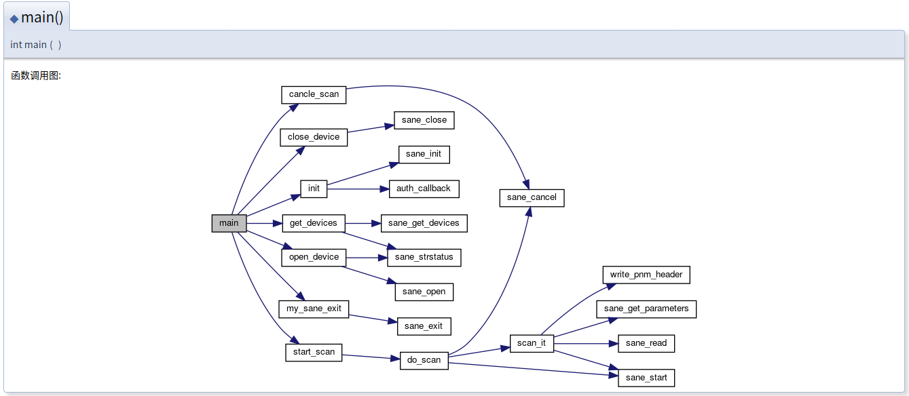

# Simple Linux SANE Scanning Application in C
:earth_asia:
:cn:

The sample demonstrates how to implement a simple document scanning application on Linux in C.
Switch to chinese :arrow_right: [Chinese](README.md)

## Getting Started
1. Install SANE:
    
    ```
    sudo apt-get update
    sudo apt-get install sane
    sudo apt-get install sane-utils
    sudo apt-get install libsane-dev
    ```

2. Download [sane-backends-1.0.25][1].
    This is not necessary.

3. Extract the package and generate a symlink:

    Ubuntu
    
    ```bash
    sudo ln –s /usr/lib/x86_64-linux-gnu/libsane.so.1 /usr/lib/libsane.so
    ```
    
4. Get the source code and change the include path:

    ```
    SANE_INCLUDE=<Your SANE package path>/include
    ```

    default: SANE_INCLUDE=/usr/include

5. Build the project: 
    ```
    make
    ```

6. Run the application:
 
    ```
    sudo ./kylinSane
    ```

7. Preview docs on web
 
    ```
    firefox docs/html/index.html
    or
    file:///home/yusq/sane-test/docs/html/index.html
    ```
    call main graph:
    

## Reference
* [SANE - Documentation][2]
* [SANE - Other github][3]
* [SANE - Documentation CN][4]

[1]:https://alioth.debian.org/frs/?group_id=30186
[2]:http://www.sane-project.org/docs.html
[3]:https://github.com/yushulx/linux-document-scanning
[4]:https://blog.csdn.net/weixin_39743893/article/details/83350568
